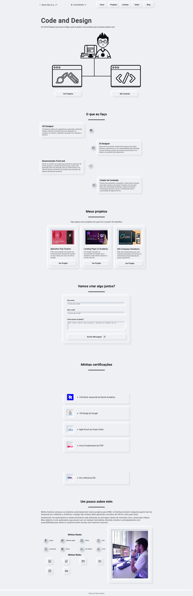
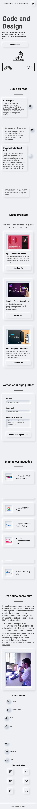

# Site portifólio

Meu portifólio de UX Engineer responsivo com foco em acessibilidade e design minimalista baseado em neomorphismo.

__Você pode ver esse projeto bem [Aqui](https://www.dener.criarbr.com)__

__Gosta de codar? então clic [Aqui](https://github.com/Dener-Garcia/site-portfolio-dener-criarbr)__

🖥️ Versão web                                                   |  📱 Versão Mobile
:----------:                                                    |  :--------------:
  |  

## 🔥 Funcionalidades
- ✅ Seleção de tema da interface para acessibilidade
- ✅ Seleção de texto grande para acessibilidade
- ✅ Navegação por teclado
- ✅ Uso do local storage para salver o tema escolhido
- ✅ Design Responsivo
- ✅ Animação com SVG
- ✅ Micro interações com Vanilla JS
- ✅ Componentização com Vanilla JS
- ✅ Consumo de API do YouTube
- ✅ Uso de API própria para envio de e-mails pelo formulário
- ✅ HTML semântico

## ⬇️ Rodando o projeto

1. Clone esse repositório ou faça o download dos arquivos para sua máquina.
2. Dentro da pasta do projeto rode os comandos abaixo
3. > npm install
4. > npm run dev
5. Você deve ter o node instalado na sua máquina.

## 🖥️ Tecnologías Utilizadas:

  
  
  
  
  
  
  
  
  

## 🤔 Aprendizados
Trabalhar com modules do JavaScript Vanilla, entender sobre import export e como criar funções que são aproveitadas por vários elementos afim de otimizar o código foi bem desafiador.
Adaptar os elementos do design para destacar itens que são clicáveis dos outros elementos mantendo a ideia de design minimalista porém acessível.

## 🖧 Vamos nos conectar?

  
    
  
    
  
    
  
    
  

